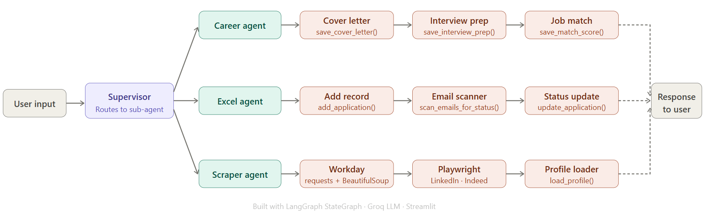
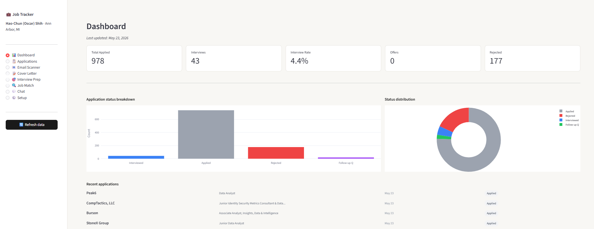

# 💼 Job Application Tracker Agent

A conversational AI agent built with LangGraph and Streamlit that helps you track, manage, and optimize your job search — powered by a Multi-agent architecture.

## Overview

Instead of manually updating spreadsheets, just ask in natural language or use the web dashboard:

- *"Show me my latest 5 applications"*
- *"Scan my emails for job updates"*
- *"Generate a cover letter for https://..."*
- *"Score my match for Caesars Entertainment"*
- *"Help me prepare for my interview at Pearl Health"*

## Architecture



### Dashboard



### Sub-agents

| Agent | Responsibilities |
|-------|-----------------|
| `ExcelAgent` | Query, add, edit, and analyze job applications |
| `EmailAgent` | Scan Gmail and auto-update application statuses |
| `CareerAgent` | Generate cover letters, interview prep, job match reports |
| `ScraperAgent` | Auto-fill missing JD data from job URLs |

### File Structure

```
job-tracker-agent/
├── main.py              # CLI entry point
├── app.py               # Streamlit web UI
├── supervisor.py        # Multi-agent supervisor
├── nodes.py             # Node logic for all agent steps
├── tools.py             # Data layer (Excel, Gmail, web scraping)
├── state.py             # Shared AgentState definition
├── agents/
│   ├── excel_agent.py   # Excel sub-agent
│   ├── email_agent.py   # Email sub-agent
│   ├── career_agent.py  # Career sub-agent
│   └── scraper_agent.py # Scraper sub-agent
├── data/
│   ├── Record_of_job_AI.xlsx  # Job application records
│   ├── profile.json           # Your background profile for AI generation
│   └── credentials.json       # Gmail API credentials (not committed)
├── cover_letters/       # Generated cover letters (auto-created)
├── interview_prep/      # Generated interview prep guides (auto-created)
├── .env                 # API keys (never commit this)
├── requirements.txt
└── README.md
```

## Setup

```bash
# 1. Create and activate virtual environment
python -m venv AIagent
.\AIagent\Scripts\activate  # Windows
source AIagent/bin/activate  # Mac/Linux

# 2. Install dependencies
pip install -r requirements.txt
playwright install chromium

# 3. Add your API key to .env
echo "GROQ_API_KEY=your_key_here" > .env

# 4. Run the CLI agent
python main.py

# 5. Or run the Streamlit web UI
streamlit run app.py
```

## Gmail Integration (Optional)

To enable email scanning:
1. Go to [console.cloud.google.com](https://console.cloud.google.com)
2. Enable the Gmail API and create OAuth 2.0 credentials
3. Download `credentials.json` and place it in the `data/` folder
4. On first run, a browser window will open for Gmail authorization

## Features

| Feature | Description |
|---------|-------------|
| 📋 Query | View all or latest N applications with filters |
| ➕ Add | Add new applications via natural language |
| ✏️ Edit | Update application status or details |
| 📊 Analyze | Get AI-powered job search analysis and advice |
| 🌐 Scrape | Auto-fill JD from job URLs using Playwright |
| 📧 Email | Scan Gmail and auto-update application statuses |
| 📝 Cover Letter | Generate tailored cover letters from JD |
| 🎯 Interview Prep | Generate full interview prep guide with STAR answers |
| 🔍 Job Match | Score your fit for a job (single or batch) |

## Tech Stack

- **LangGraph** — Multi-agent orchestration and state management
- **LangChain + Groq** — LLM inference (llama-4-scout)
- **Streamlit** — Web dashboard UI
- **Playwright** — Dynamic web scraping
- **openpyxl** — Excel read/write
- **Gmail API** — Email scanning
- **python-docx** — Word document generation
